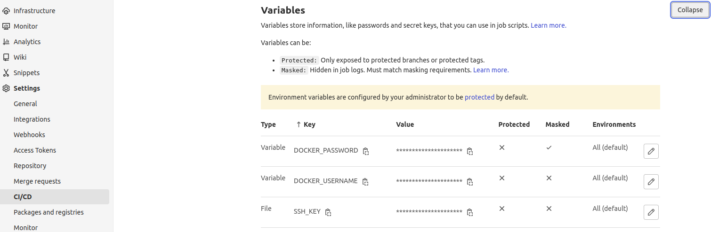

# Snapp-Project

## Introduction

This project is the Snapp assignment and all tasks and documents have been put Here. The Repo contains Ansible playbook, Sample application repo, Dockerfile and Shell scripts.

The file structure is as follows:

- **application**: Contains files and scripts related to the application and its deployments.

- **gitlab-runner**: Contains files and scripts related to deploying Gitlab Runner.

- **ingress**: Contains Nginx Ingress files and objects.

## Prerequisites

For this scenario We have deployed a Kubernetes cluster with two nodes by kubespray:

- **OS**: CentOS 7 , **IP**:192.168.24.66 , **SSH-PORT**: 22 , **ROLE**: Control-Plane
- **OS**: CentOS 7 , **IP**:192.168.24.118 , **SSH-PORT**: 22 , **ROLE**: Worker

Also we have another machine which our Gitlab server and Docker registry are deployed there. The specifications are:

- **OS**: CentOS 7 , **IP**:192.168.24.216 , **SSH-PORT**: 3031

The Gitlab server is accessible by https://git-test.kavano.org:8443 and the Docker registry is accessible via https://reg-test.kavano.org.
 

**NOTE**: The reason we used domain is because of security issues with self-signed ssl certificates.

**NOTE**: To gain some power of Ansible with Kubernetes, we have installed some packages.
We have Run this command in Kubernetes control plane node:
```
pip3 install kubernetes
```
Also, this command in your Ansible control node:
```
ansible-galaxy collection install kubernetes.core
```

**NOTE**: We need to define some variables as shown below in our Gitlab panel:

- DOCKER_PASSWORD
- DOCKER_USERNAME
- SSH_KEY



Let's get started with files and directories and see what are they.

## Gitlab Runner

The first thing we need to do is to deploy our Runner and connect it to our Kubernetes cluster. For this purpose we have prepared these files and directories:

- **manifests**: Contains all Kubernetes manifests used to deploy the Runner.
- **deploy.yaml**: The Ansible playbook responsible to deploy the Runner.
- **secrets.yaml**: Sensitive variables which are used inside the playbook.

### deploy.yaml

Let's see the details of the playbook and explain each block and line of it.


```
- hosts: master
  remote_user: root
  connection: ssh
  gather_facts: false
```
This block defines the specification of the target machine which is our master or control plane node. We have disabled the "gather_facts" because we don't need the facts and there is no benefit in it for us right now.
```
vars_files:
          - ./secrets.yaml
```
We used "secrets.yaml" file here which contains our tokens and we will use the tokens in later scripts.

Now Let's explore the "tasks" area.
```
- name: Create Runner Namespace
            kubernetes.core.k8s:
                    name: gitlab-runner
                    api_version: v1
                    kind: Namespace
                    state: present
```
Creates the "gitlab-runner" name space. The runner will be run in this name space.
```
- name: Deploy Runner ServiceAccount Manifest
            kubernetes.core.k8s:
                    state: present
                    definition: "{{ lookup('file', './manifests/ServiceAccount.yaml') | from_yaml }}"
                    apply: true 
```
Deploys the Gitlab Runner ServiceAccount manifest on cluster. It will fetch the content of "ServiceAccount.yaml" inside manifests directory.

```
- name: Deploy Runner Role Manifest
            kubernetes.core.k8s:
                    state: present
                    definition: "{{ lookup('file', './manifests/Role.yaml') | from_yaml }}"
                    apply: true
```
Deploys the Gitlab Runner Role manifest on cluster. It will fetch the content of "Role.yaml" inside manifests directory.

```
- name: Deploy Runner RoleBinding Manifest
            kubernetes.core.k8s:
                    state: present
                    definition: "{{ lookup('file', './manifests/RoleBinding.yaml') | from_yaml }}"
                    apply: true
```
Deploys the Gitlab Runner RoleBinding manifest on cluster. It will fetch the content of "RoleBinding.yaml" inside manifests directory.

```
- name: Register Runner to the project
            uri:
                    url: "https://git-test.kavano.org:8443/api/v4/runners"
                    method: POST
                    body_format: form-multipart
                    status_code: [200, 201]
                    body:
                            token: "{{ registration_token }}"
                            description: Kubernetes runner for snapp project
                            tag_list: snapp-project,python
            register: result
```
Creates a POST request with body composed of Runner registration token, description and tags.
This will return a dict response.

```
- set_fact:
                  runner_token={{ result.json.token }}
```
Stores the **token** of the result of POST request as an fact.

```
- name: Get Runner ID
            uri:
                    url: "https://git-test.kavano.org:8443/api/v4/runners/all?tag_list=snapp-project,python&type=project_type"
                    method: GET
                    headers:
                            PRIVATE-TOKEN: "{{ access_token }}"
            register: result
```
Creates a GET request with header composed of User's auth token.
This will return a dict response.

```
- set_fact:
                  runner_id={{ result.json[0].id }}
```
Stores the **id** of the result of POST request as an fact.

```
- name: Deploy Configmap
            kubernetes.core.k8s:
                    state: present
                    apply: true
                    definition:
                      apiVersion: v1
                      kind: ConfigMap
                      metadata:
                        name: gitlab-runner-config
                        namespace: gitlab-runner
                      data:
                        config.toml: |-
                          concurrent = 3
                          .
                          .
                          .
```
This part contains all Gitlab Runner configuration which must exists in "/etc/gitlab-runner/config.toml" when Runner starts.
It will define the config as ConfigMap and pass it to Kubernetes api-server.
NOTE: Some lines are emited to avoid unnecessary explanation.

```
- name: Deploy Runner Deployment Manifest
            kubernetes.core.k8s:
                    state: present
                    definition: "{{ lookup('file', './manifests/Deployment.yaml') | from_yaml }}"
                    apply: true
```
Finally, the main Runner deployment manifest gets deployed by this part.
It will fetch the content of "ServiceAccount.yaml" inside manifests directory.

### secrets.yaml

We have created this file by using ansible vault:
```
ansible-vault create secrets.yaml
```
and we put two variables in it: **registration_token** and **access_token**.

**registration_token** is a token assigned for each project which Runners use it to connect to the project.
**access_token** is a private token that we as Gitlab user have generated in order to access the Gitlab's API.

If we decrypt this file, it will be like this:
```
registration_token: <TOKEN>
access_token: <TOKEN>
```

### manifests

Here we have 4 manifests.

- ServiceAccount.yaml
- Role.yaml
- RoleBinding.yaml
- Deployment.yaml


**ServiceAccount.yaml**
```
kind: ServiceAccount
metadata:
  name: gitlab-admin
  namespace: gitlab-runner
```
In this manifest we have defined a service account named "gitlab-admin" inside "gitlab-runner" namespace as you can see in lines 3 and 4.

**Role.yaml**
```
kind: Role
metadata:
  namespace: gitlab-runner
  name: gitlab-admin
rules:
  - apiGroups: [""]
    resources: ["pods","pods/attach","pods/exec","configmaps","secrets"]
    verbs: ["get", "list", "watch", "create", "update", "patch", "delete"]
```
We have defined a role named "gitlab-admin" whithin "gitlab-runner" namespace in lines 3 and 4.
We have also defined the api groups, resources and actions that this Role has access and can perform in lines 6, 7 and 8. This permissions are necessary for our Runner to create and run pods otherwise it will malfunction.

**RoleBinding.yaml**
As you saw above, we defined Role and ServiceAccount, But we need to tie them together so we have to use RoleBinding.
We have defined this RoleBinding in "gitlab-runner" namespace with name "gitlab-admin".
```
subjects:
  - kind: ServiceAccount
    name: gitlab-admin
    namespace: gitlab-runner
roleRef:
  kind: Role
  name: gitlab-admin
```
NOTE: Some lines are emited to avoid unnecessary explanation.

As you can see, we have defined the ServiceAccount's name and Role's name to connect them together.

**Deployment.yaml**
Now we choose some parts of this manifest and explain them.
```
metadata:
  name: gitlab-runner
  namespace: gitlab-runner
```
Define deployment with name "gitlab-runner" with namespace "gitlab-runner".
```
selector:
    matchLabels:
      name: gitlab-runner
```
Match the templates with label "gitlab-runner".
```
serviceAccountName: gitlab-admin
```
Use the ServiceAccount we created earlier to restrict access.
```
image: gitlab/gitlab-runner:latest
```
Use the image "gitlab/gitlab-runner:latest" from docker hub for containers.
```
resources:
            requests:
              cpu: "100m"
              memory: "256Mi"
            limits:
              cpu: "200m"
              memory: "512Mi"
```
Specify the amount of resources that this pod can use. There are two sections: requests and limits. The first one is the minimum that is reserved
and the second one is the maximum which must not be exceeded.

Here we allowed the minimum CPU 0.1 with 256MB Memory and maximum CPU 0.2 with 512MB Memory.
```
volumeMounts:
            - name: config
              mountPath: /etc/gitlab-runner/config.toml
              readOnly: true
              subPath: config.toml
```
Use the volume "config" which have defined below. Mount this volume as "read-only" to Gitlab Runner's config path, so that we can use our own config file
for the Runner.
```
volumes:
        - name: config
          configMap:
            name: gitlab-runner-config
```
Define a volume named "config" with the value of ConfigMap "gitlab-runner-config". The "gitlab-runner-config" ConfigMap was defined in Ansible playbook.

### Deploy

Finally to deploy the Runner we use this command inside **gitlab-runner** directory which will prompt us to enter vault pass:
```
ansible-playbook --ask-vault-pass deploy.yaml
```

## application

Now we need to deploy our application. We need the contents of **application** directory to do so. We have:

- **manifests**: All manifests needed to deploy our app in Cluster.
- **repo**: Main sample code, Gitlab CICD file and Dockerfile.
- **scripts**: Contains scripts which are needed to deploy a new release and keeping version history.

### repo

Here we have our main code which is a sample code forked from "https://github.com/codefresh-contrib/python-flask-sample-app".
This code is written in Python 3 and is simple flask app.

We have put a route "/check" in "__init__.py" inside flaskr directory:
```
@app.route("/check")
    def check():
        return "OK"
```
Which acts as healthcheck endpoint and returns "OK" as response.

**check.sh**
This file contains the commands to perform custom health check which is used in app deployment manifest.
Let's have a look.
```
RESULT=$(curl http://localhost:5000/check)

if [ $RESULT = "OK" ]
  then
    exit 0
else
    exit 1
fi
```
As is shown above, it will curl the app and checks the response to see if it is "OK" or not.

**Dockerfile**
We also have a Dockerfile which is built and pushed to Docker registry everytime pipeline is executed.
Some of the important lines are shown below:
```
FROM python:3.8-alpine
RUN apk update && apk add curl
COPY check.sh /tmp
RUN chmod +x /tmp/check.sh
EXPOSE 5000
CMD [ "flask", "run", "--host=0.0.0.0" ]
```
Line 1 specifies the base image of our image.
Line 2 installs curl command because we're gonna need it for our health check.
Line 3 copies check.sh file to container.
Line 4 adds execute permission to check.sh.
Line 5 indicates that this app is listening on port 5000.
Line 6 defines command option which will run app for all remote IPs.

**.gitlab-ci.yml**
This is the Gitlab CICD file.
Here we have 3 stages:

- **build**
- **deploy**
- **rollback**

In build stage we have:
```
image: docker:20.10.21-dind
```
which indicates the image used for this stage. The reason is for this is we need docker daemon to build and our Dockerfile.

```
resource_group: production
```
We run our stage in production resource group in order to avoid parallel issues.
```
tags:
                - snapp-project
```
Specifies the tag which used by Runners to see who should run this job.
```
docker login -u $DOCKER_USERNAME -p $DOCKER_PASSWORD $REGISTRY_ADDR
```
Logins to Docker registry with variables defined in Gitlab panel.
```
dockerd --host tcp://127.0.0.1:2375 &
```
Runs Docker daemon in background because the daemon is not started by default.
This daemon listens on port 2375.
```
docker build --network host -t $REGISTRY_ADDR/$IMAGE_NAME:"$IMAGE_TAG" .
```
Builds the Docker image with the tag provided in git commit.
The image uses host network.
```
docker push $REGISTRY_ADDR/$IMAGE_NAME:"$IMAGE_TAG"
```
Finally push image to Docker registry
```
only:
                - tags
```
This forces CICD to only get triggered when there is a new tag pushed to Repo.

In deploy stage we have:
```
image: kroniak/ssh-client
```
Which specifies the image for this stage. This image is an alpine image and ssh installed on it.
We use this image to ssh into our target server.
```
ssh -o StrictHostKeyChecking=no -i $SSH_KEY root@192.168.24.66 "
                  /opt/snapp_project/scripts/deploy.sh $IMAGE_TAG
                  "
```
Connects to target server via ssh and executes a shell.
This shell applies our new manifest and takes care of versioning.

In Rollback stage we have:
```
rules:
                - if: $ROLLBACK == "true"
                  when: manual
```
This block makes this stage to only run by manual trigger and also setting variable "ROLLBACK" equal to "true".
Whenever pipeline runs automatically, this stage is ignored.

### manifests

All manifests related to deploying this app are here, including:

- deployment.yaml
- hpa.yaml
- service.yaml

### scripts

There are 2 Shell scripts here which are used in our CICD process:

- deploy.sh
- rollback.sh


## ingress

This directory contains the Ingress object for our app service.

- ingress.yaml

We use Nginx Ingress as content load balancer.

# Send traffic to our App

We have 3 approached to do so.

- NodePort
- Ingress
- Metallb